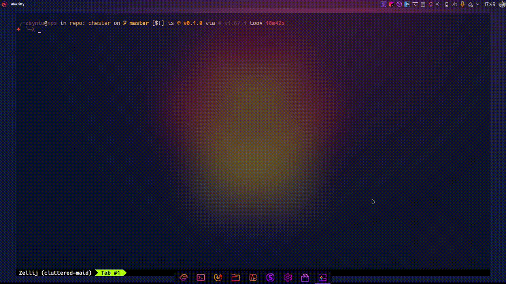

<div align="center">

  <h1><code>chester</code></h1>

  <h3>
    <strong>Like Tester but with Ch</strong>
  </h3>

  <p>
    
    <a href="https://codecov.io/gh/devzbysiu/chester">
      
    </a>
    
  </p>

  <h3>
    <a href="#about">About</a>
    <span> | </span>
    <a href="#installation">Installation</a>
    <span> | </span>
    <a href="#configuration">Configuration</a>
    <span> | </span>
    <a href="#license">License</a>
    <span> | </span>
    <a href="#contribution">Contribution</a>
  </h3>

  <sub><h4>Built with 🦀</h4></sub>
</div>

# <p id="about">About</p>

Chester is a daemon running in the background. It listens for the changes in the project you are working on
and after every change it runs the tests. The results are exposed via REST API on local socket, so you can
build your own software on top of that.

Example use of chester: [Always On Tests](https://github.com/devzbysiu/aot) - periodically gets test results and
display them using small desktop widget.



The test is changed to make tests fail. After save, in the top right corner you can see the widget starts
blinking which means that tests started. After the tests finish, the widget changes
to red which means, that tests failed. Next, the test is fixed and changes are saved. The widget is bliking and then
changes to green which means the tests passed.

**Note:** Keep in mind the GIF above is a separate project which uses chester.

## Chester API

### Tests status
```bash
curl --unix-socket "/run/user/$(id -u)/chester.sock" http://chester/tests/status  
```

### Update repository on which tests are run
```bash
curl --unix-socket "/run/user/$(id -u)/chester.sock" \
  -XPUT -H "Content-Type: application/json" \
  -d '{"repo_root": "<new repo path here>"}' \
  http://chester/repo/root
```

# <p id="installation">Installation</p>

```bash
cargo install --git https://github.com/devzbysiu/chester
```

# <p id="configuration">Configuration</p>

## --- TODO ---

# <p id="license">License</p>

This project is licensed under either of

- Apache License, Version 2.0, (LICENSE-APACHE or http://www.apache.org/licenses/LICENSE-2.0)
- MIT license (LICENSE-MIT or http://opensource.org/licenses/MIT)

at your option.

# <p id="contribution">Contribution</p>


Unless you explicitly state otherwise, any contribution intentionally submitted for inclusion in the work by you, as defined in the Apache-2.0 license, shall be dual licensed as above, without any additional terms or conditions.
